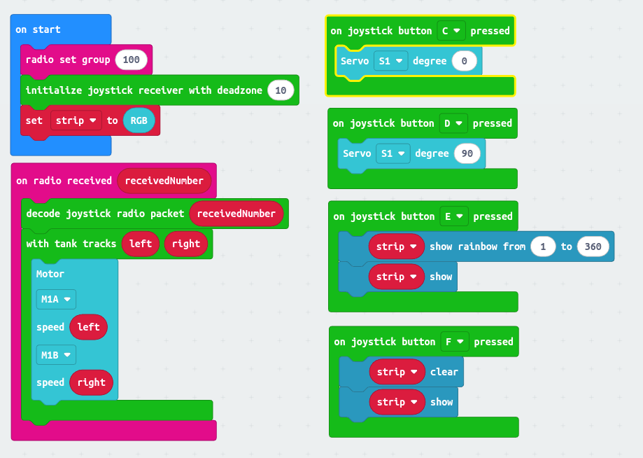

# Joystickbit Radio

A MakeCode extension that handles a binary bitmask to represent a joystick state. This allows you to handle full state exchange in a single radio message. I've also included some creature comforts to take the worst out of robotics for new programmers.

## Features

- Encode joystick X and Y positions
- Encode buttons C, D, E and F
- Decode a received radio number back into joystick values
- Utility functions for:
  - Remapping axes
  - Turning the joystick into a simple tank controller

## Transmitter

```blocks
radio.setGroup(100)
radio.sendNumber(joystickRadio.bitmask())
```

## Receiver

```blocks
radio.setGroup(100)
joystickbitRadio.initialize(10)  // set the deadzone to 10

radio.onReceivedNumber(function (receivedNumber) {
    joystickRadio.decode(receivedNumber)
})

joystickbitRadio.onButtonPressed(joystickbitRadio.Button.D, function () {
    basic.showIcon(IconNames.Heart)
})
```



## License

MIT